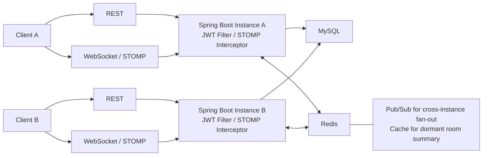
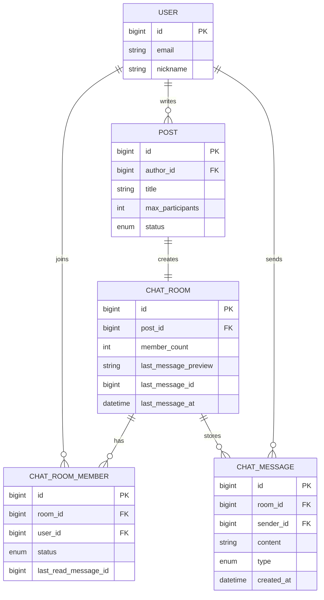

# chat-domain-rebuild

게시글 기반 그룹 채팅 도메인 경험을 바탕으로 보안, 조회 성능, 확장성 관점에서 다시 설계한 Spring Boot 백엔드 프로젝트

---

## 개발 배경 및 핵심 목표

기존 팀 프로젝트에서 채팅 기능은 동작했지만, 개선이 필요한 지점들이 눈에 띄었습니다.

첫째, 메시지 작성자를 클라이언트가 전달하는 값이 아닌 서버 인증 주체로 확정해야 했습니다.

둘째, 채팅 히스토리와 채팅방 목록 조회를 더 명확한 RDB 모델과 정량적인 성능 개선으로 보여줄 필요가 있었습니다.

셋째, 단일 인스턴스 구조를 넘어 멀티 인스턴스 환경에서도 같은 채팅방의 메시지가 정상적으로 전달되는 구조를 만들고 싶었습니다.

기존 구현이 실시간 메시지 송수신 중심이었다면, 이번 리빌드는 다음 6가지를 개선하는 데 초점을 맞췄습니다.

- JWT principal 기반 sender 결정과 STOMP 인증/인가로 메시지 신뢰 경계 강화
- 관계형 모델링으로 채팅 도메인의 운영 규칙을 구조화하기
- 동시 참여 상황에서 정원과 멤버십 정합성을 보장하는 동시성 제어
- QueryDSL projection + summary + cursor pagination 중심의 조회 성능 개선
- Redis 역할을 휴면 summary cache와 Pub/Sub으로 분리한 설계 경계 명확화
- Redis Pub/Sub 기반 다중 인스턴스 메시지 브로드캐스트 구현

---

## 기술 스택

- **Language / Framework**: Java 17, Spring Boot 3.5, Spring Security, Spring WebSocket/STOMP
- **Persistence**: Spring Data JPA, QueryDSL 5.1, MySQL 8.4
- **Cache / Messaging**: Spring Data Redis, Redis 7.4, Redis Pub/Sub
- **Auth**: JWT (JJWT 0.13), Argon2 Password Encoder
- **Docs / Test**: Springdoc OpenAPI 2.8, JUnit 5, Testcontainers
- **Infra / Tooling**: Docker Compose, GitHub Actions, Gradle

---

## 다중 인스턴스 확장 구조

- 운영 배포를 하지는 않았지만, 같은 MySQL/Redis를 바라보는 2개 앱 인스턴스를 테스트에서 함께 띄워 cross-instance 메시지 전달을 검증했습니다.
- 이 다이어그램은 "현재 운영 중인 배포도"가 아니라 "이 프로젝트가 설명하고 검증한 scale-out 구조"입니다.

---

## 도메인 ERD 요약

---

## 핵심 API 요약

### REST API

- `GET /api/chat-rooms`
    - 내 채팅방 목록 조회
    - 복합 cursor(`cursorLastMessageAt`, `cursorRoomId`) 기반 페이지네이션
    - `keyword` 검색 지원
- `GET /api/chat-rooms/{roomId}`
    - 채팅방 summary 조회
- `GET /api/chat-rooms/{roomId}/messages`
    - 메시지 히스토리 조회
    - cursorMessageId가 없으면 최신 페이지 조회
    - cursorMessageId가 있으면 cursor 기반 다음 페이지 조회
- `PATCH /api/chat-rooms/{roomId}/read`
    - 마지막 읽은 메시지 기준 읽음 처리

### STOMP

- `SEND /pub/chat-rooms/{roomId}/messages`
    - 채팅 메시지 전송
    - sender는 클라이언트가 보내지 않고 서버가 JWT principal로 결정
- `SUBSCRIBE /sub/chat-rooms/{roomId}`
    - 채팅방 메시지 구독

---

## 성능 측정

| 지표 | 기준선 | 1차 재측정 | 2차 재측정 | 비고 |
| --- | ---: | ---: | ---: | --- |
| 방 목록 median p95 | `1589.914ms` | `47.195ms` | `43.766ms` | 1차 `97.03%` 개선, 2차 `97.25%` 개선 |
| 메시지 히스토리 최신 페이지 median p95 | `35.692ms` | `39.699ms` | `41.895ms` | 1차 `11.23%` 악화, 2차 `17.38%` 악화 |
| 메시지 히스토리 cursor 페이지 median p95 | `86.883ms` | `120.251ms` | `76.373ms` | 1차 `38.41%` 악화, 2차 `12.10%` 개선 |
| 방 목록 쿼리 수 | `161` | `1` | `1` | 1차와 2차 모두 `99.38%` 감소 |

### 개선 과정

1. `기준선`
room list는 페이지 크기만큼 자르기 전에 전체 활성 방을 먼저 계산하는 구조였고, 메시지 히스토리는 단순 JPA/JPQL 중심 읽기 구조였습니다.

2. `1차 개선: 조회 구조 단순화`
채팅방 목록 조회를 `전체 활성 방 계산 후 페이지 절단` 구조에서 `QueryDSL projection + chat_rooms summary + cursor 기반 조회` 구조로 바꾸고, 메시지 히스토리 조회도 `단순 JPA/JPQL 조회`에서 `cursorMessageId` 기준 cursor pagination 구조로 정리했습니다. 이 단계에서 room list p95와 query count가 크게 줄었습니다.

3. `2차 개선: 메시지 조회 읽기 경량화 (DTO projection, exists query)`
멤버 확인을 `ChatRoomMember 엔티티 조회`에서 `existsByRoomIdAndUserIdAndStatus(...)` 기반 존재 확인으로 바꾸고, 메시지 히스토리 조회를 `ChatMessage 엔티티 + sender join fetch` 방식에서 `응답용 DTO projection 직접 조회` 방식으로 바꿨습니다. cursor 조회는 기준선보다 낮아졌지만, latest 조회는 이번 결과만으로 개선을 확정하지 않았습니다.

---

## 기술적 의사결정 & 트러블슈팅

- Redis는 room list 전체를 캐시하는 대신, [휴면 room summary cache + Pub/Sub 중심 역할](docs/architecture/redis-direction-plan.md)로 경계를 분리했습니다.
- 성능 문서는 [최신 raw 결과](docs/performance/measurements/latest-measurement.md)와 [공식 비교 스냅샷/요약](docs/performance/results-and-history.md)을 분리해, 실행할 때마다 바뀌는 수치와 확정 기록이 섞이지 않게 정리했습니다.
- 구현 과정에서 반복해서 부딪힌 판단과 해석 기준은 [트러블슈팅 문서](docs/troubleshooting/README.md)에 누적해 두었습니다.

---
